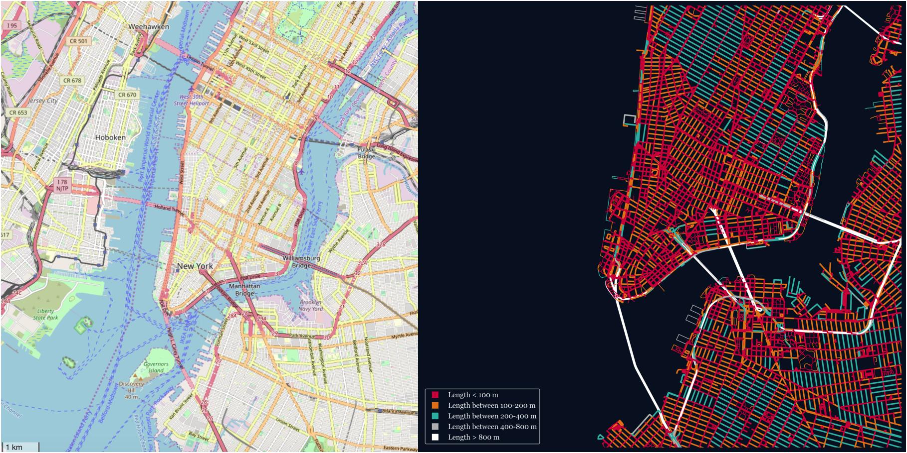

### Usage

What you'll need to do (via Terminal) in order to use this program:
* `conda install -c anaconda networkx`
* `conda install geopandas`
* `conda install -c anaconda pillow`
* `pip install geopy`

When you are prompted to input a city, you must enter it in a format
that matches the following:
Portland, Oregon, USA

### Original Data >>> Generated Map
#### New York, NY, USA

#### Boston, MA, USA

### More Sample Results

#### Portland, OR, USA

#### Copenhagen Municipality, Denmark

#### Venice, Itality

Try it out for yourself!

When I get some time, I'm going to try to make a custom color picker
for those design-oriented people out there.
