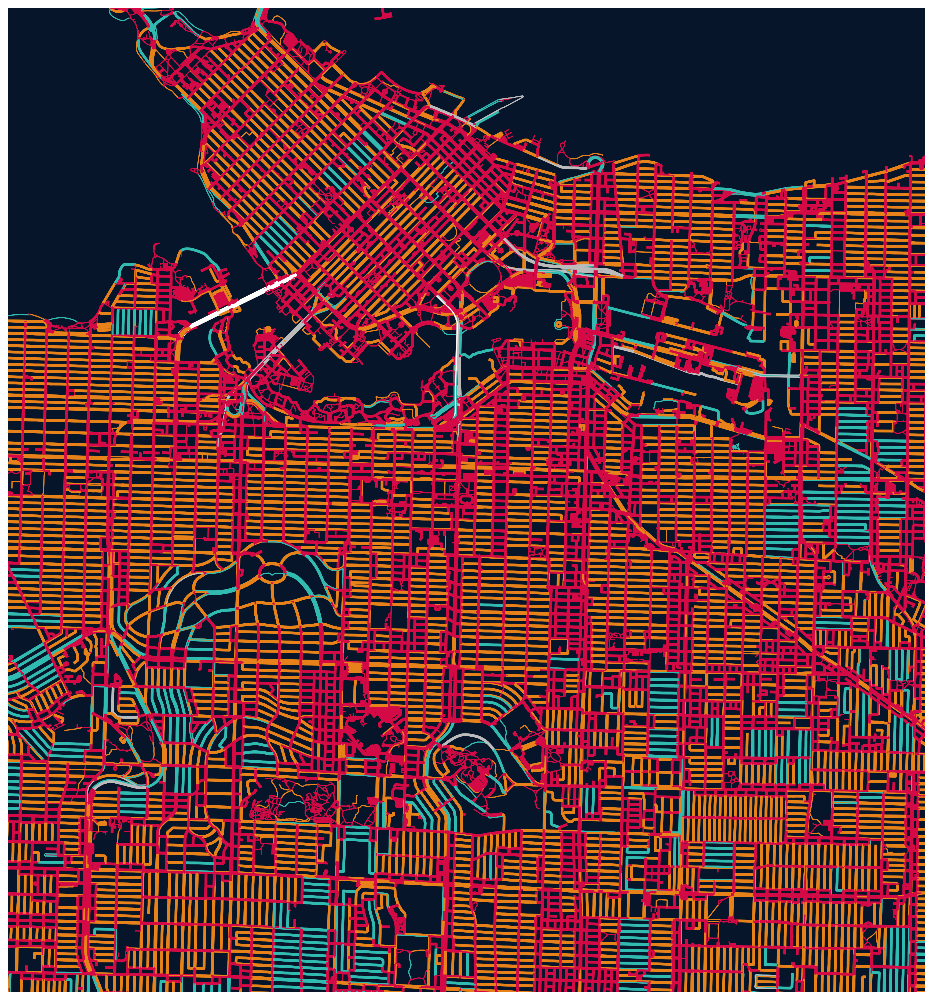

# map-network-viz

### Description 

This library contains functionality for visualizing street networks and making artistic maps with OpenStreetMap and Networkx. It works by wrapping around the `osmnx` library to pull city network data (nodes and edges), but it is specifically designed to help end users make highly customizable, color-coded maps!

### Installation

```bash
python3 -m pip install map-network-viz
```

### Example Usage

```python
from map_network_viz import *
PALETTE = ["#FFB7C3", "#750d37", "#F57A80", "#F6BD60", "#AAE28D", "#aadaba", "#27BACE", "#F0F2A6"]
graph_city("Portland, Oregon, USA", PALETTE)
```

### Map Gallery

