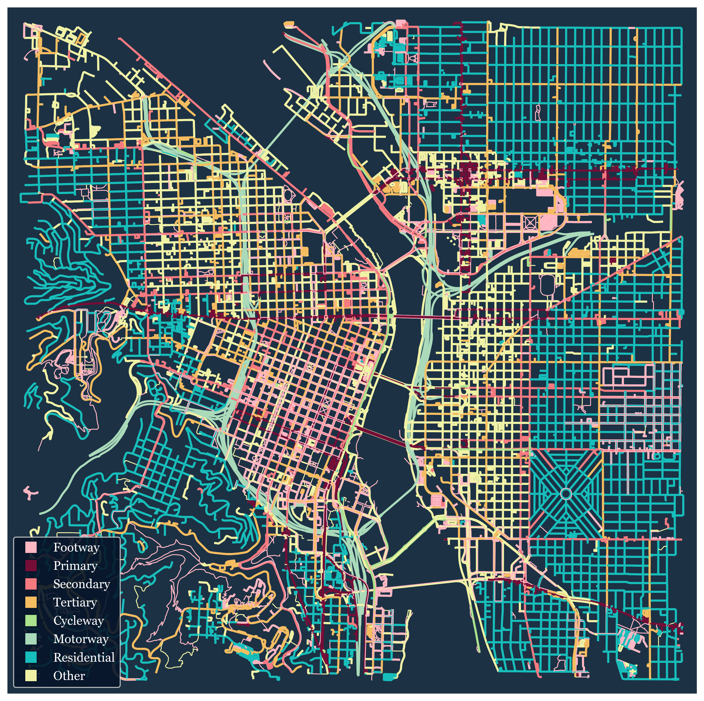
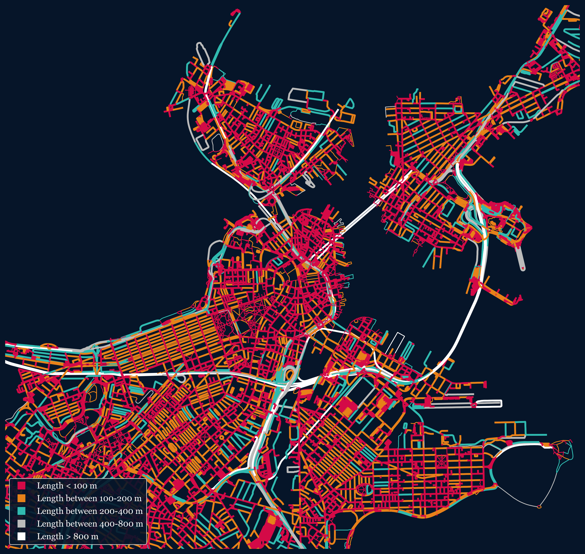
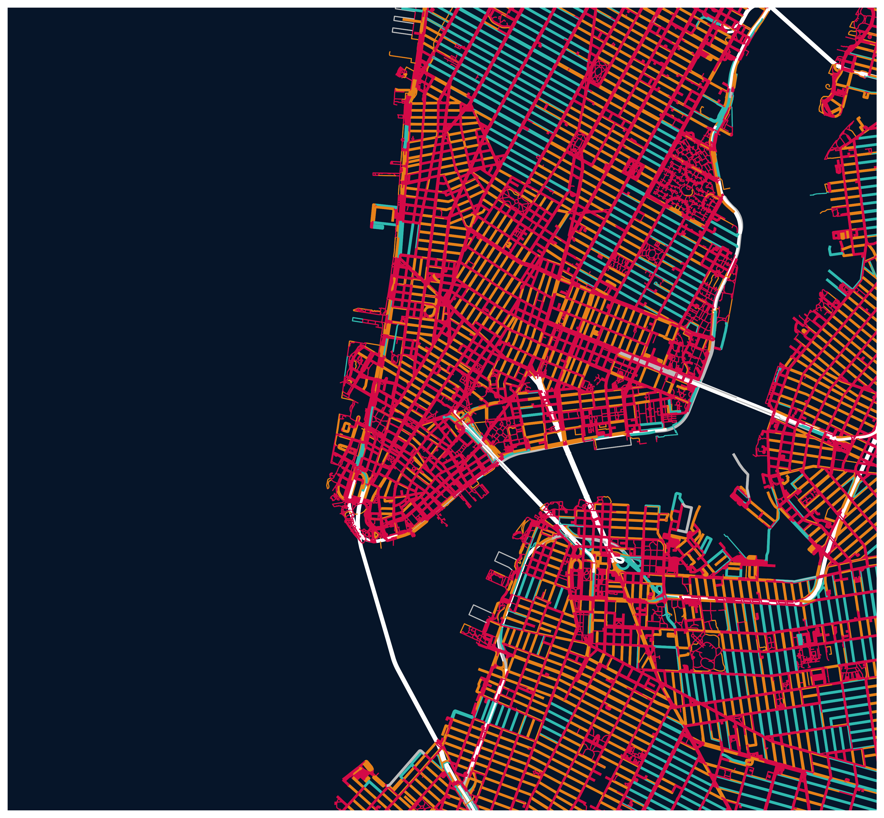

### Usage

What you'll need to do (via Terminal) in order to use this program:
* `conda install -c anaconda networkx`
* `conda install geopandas`
* `conda install -c anaconda pillow`

When you are prompted to input a city, you must enter it in a format
that matches the following:
Portland, Oregon, USA

### Sample Results

 

