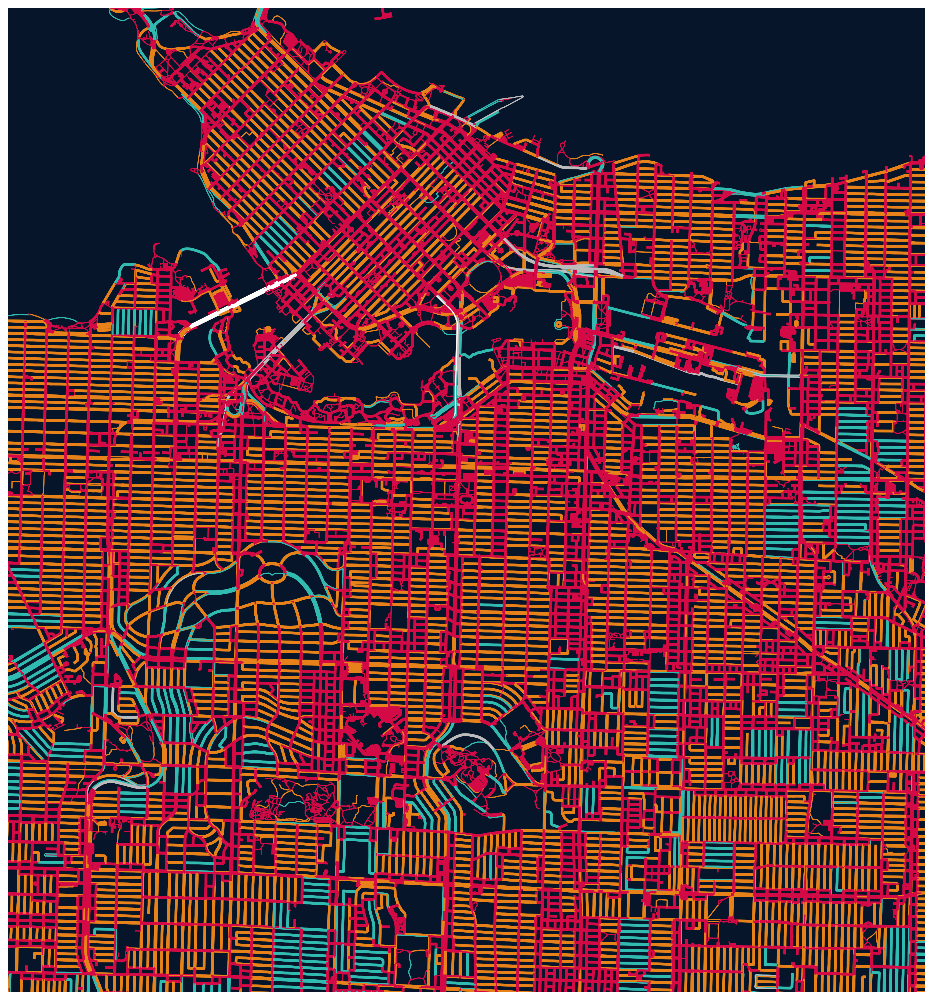
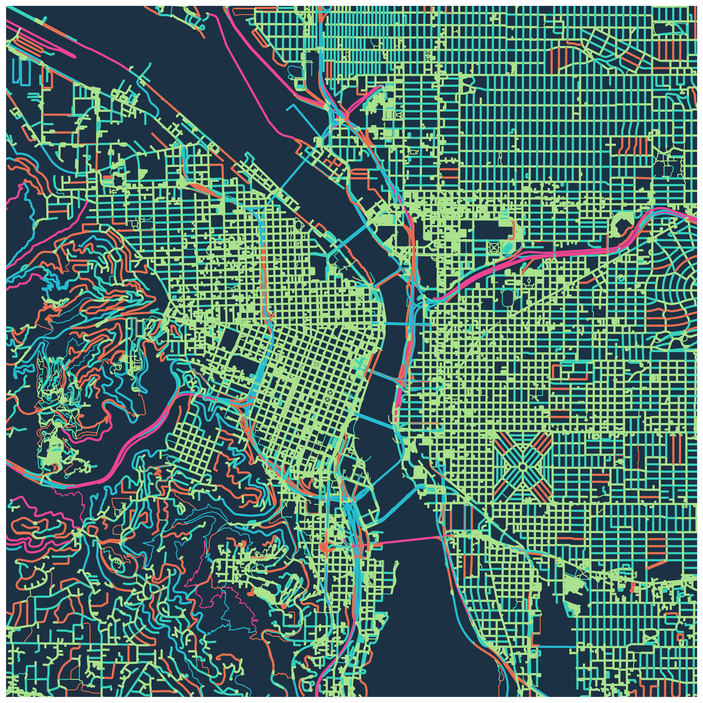

### Usage

What you'll need to do (via Terminal) in order to use this program:
* `conda install -c anaconda networkx`
* `conda install geopandas`
* `conda install -c anaconda pillow`
* `pip install geopy`

When you are prompted to input a city, you must enter it in a format
that matches the following:
- > Portland, Oregon, USA
- > Sydney, Australia

### Comparison

### Sample Maps

